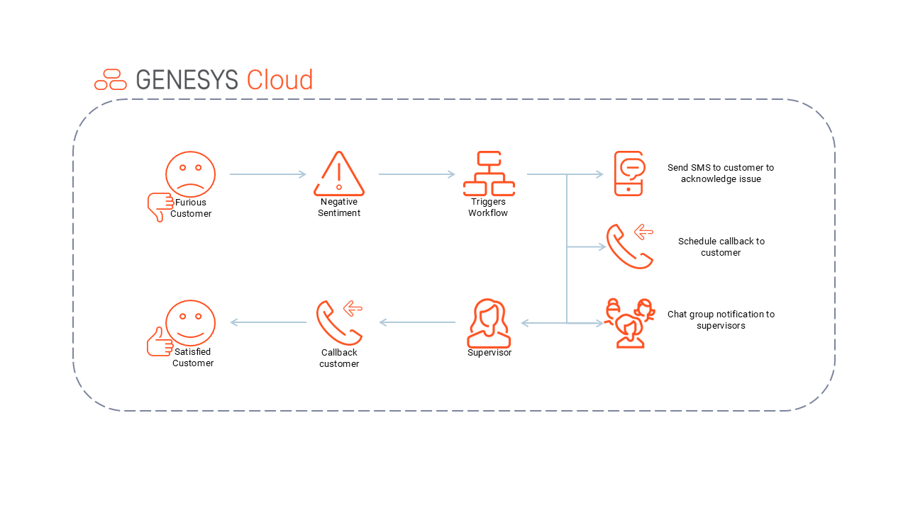
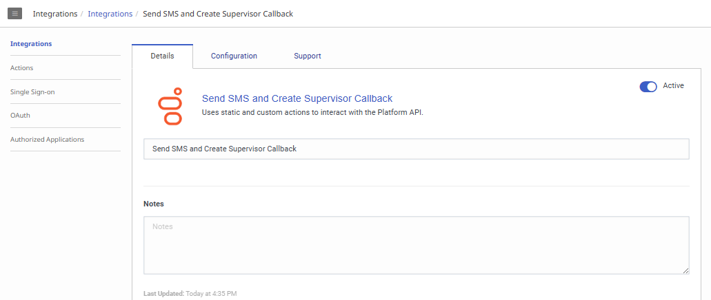
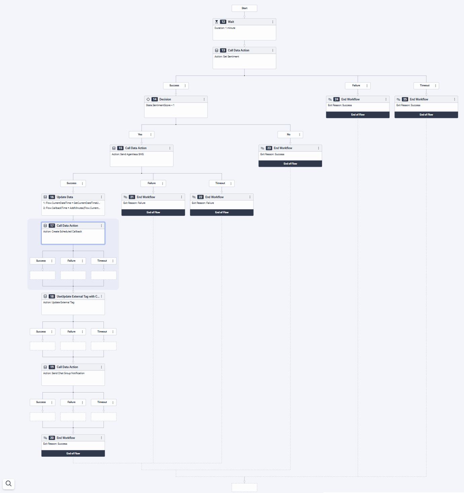
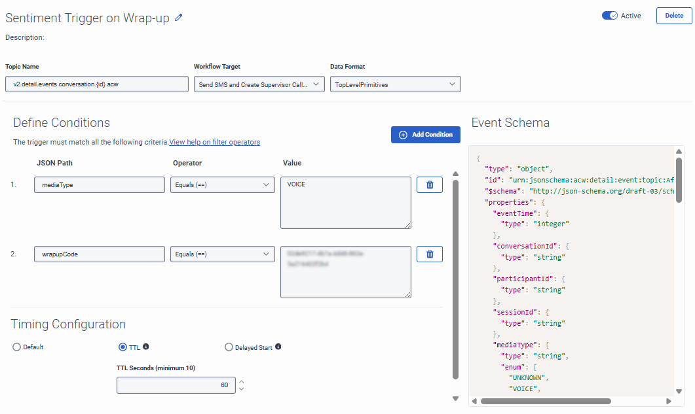

# Proactively reach out to customers with negative sentiment score and create supervisor callback

This Blueprint is a series of Architect Flows with a Trigger that fires on every conversation finishing to analyze the sentiment score and determine if it was negative. For conversations with negative sentiment, the Architect Workflow sends the customer an SMS message acknowledging the issue, and creates a callback that is placed into a Queue staffed with supervisors or team leads to reach back out to the customer to see if anything can be done to help.

This trigger and workflow are designed to provide near-immediate notification to supervisors of calls with negative sentiment.  The workflow gets the interaction sentiment score and sends three different notification types:  SMS message, Scheduled Callback and/or chat group notification.  For demo purposes, this trigger is keyed off of a specific wrap-up code as we didn’t want every call interaction to trigger the workflow.  In a customer environment, the trigger would likely be executed at the end of each ACD interaction.



## Solution components

* **Genesys Cloud** - A suite of Genesys cloud services for enterprise-grade communications, collaboration, and contact center management. Contact center agents use the Genesys Cloud user interface.
* **Genesys Cloud API** - A set of RESTful APIs that enables you to extend and customize your Genesys Cloud environment.
* **Data Action** - Provides the integration point to invoke a third-party REST web service or AWS lambda.
* **Architect flows** - A flow in Architect, a drag and drop web-based design tool, dictates how Genesys Cloud handles inbound or outbound interactions.
* **Triggers** - Provides the ability for a data action and architect workflow to work cohisively to perform the task.

## Prerequisites

### Specialized knowledge

* Administrator-level knowledge of Genesys Cloud
* Expereince with REST API authentication

### Genesys Cloud account

* A Genesys Cloud CX 1 license. For more information, see [Genesys Cloud Pricing](https://www.genesys.com/pricing "Opens the Genesys Cloud pricing article").
* The Master Admin role in Genesys Cloud. For more information, see [Roles and permissions overview](https://help.mypurecloud.com/?p=24360 "Opens the Roles and permissions overview article") in the Genesys Cloud Resource Center.

## Implementation steps

You can implement Genesys Cloud objects manually or with Terraform.
* [Configure Genesys Cloud using Terraform](#configure-genesys-cloud-using-terraform)
* [Configure Genesys Cloud manually](#configure-genesys-cloud-manually)

### Download the repository containing the project files

Clone the [negative-sentiment-callback repository](https://github.com/GenesysCloudBlueprints/negative-sentiment-callback "Goes to the negative-sentiment-callback repository") in GitHub.

## Configure Genesys Cloud using Terraform

### Set up Genesys Cloud

1. Set the following environment variables in a terminal window before you run this project using the Terraform provider:

   * `GENESYSCLOUD_OAUTHCLIENT_ID` - This variable is the Genesys Cloud client credential grant Id that CX as Code executes against. 
   * `GENESYSCLOUD_OAUTHCLIENT_SECRET` - This variable is the Genesys Cloud client credential secret that CX as Code executes against. 
   * `GENESYSCLOUD_REGION` - This variable is the Genesys Cloud region in your organization.

2. Set the environment variables in the folder where Terraform is running. 

### Configure your Terraform build

* `client_id` - The value of your OAuth Client ID using Client Credentials to be used for the data action integration.
* `client_secret`- The value of your OAuth Client secret using Client Credentials to be used for the data action integration.
* `sms_number` - The purchased SMS number with the format `+11234567890`.
* `callback_queue` - The name of your configured queue for handling callbacks.
* `wrapup_code` - The name of your configured wrap up code for negative customer interactions.

The following is an example of the dev.auto.tfvars file.

```
client_id       = "your-client-id"
client_secret   = "your-client-secret"
sms_number      = "+11234567890"
callback_queue  = "callback-queue-name"
wrapup_code     = "wrapup_code"
```

### Run Terraform

The blueprint solution is now ready for your organization to use. 

1. Change to the **/terraform** folder and issue the following commands:

   * `terraform init` - This command initializes a working directory containing Terraform configuration files.  
   * `terraform plan` - This command executes a trial run against your Genesys Cloud organization and displays a list of all the Genesys Cloud resources Terraform created. Review this list and make sure that you are comfortable with the plan before you continue to the next step.
   * `terraform apply --auto-approve` - This command creates and deploys the necessary objects in your Genesys Cloud account. The `--auto-approve` flag provides the required approval before the command creates the objects.

After the `terraform apply --auto-approve` command successfully completes, you can see the output of the command's entire run along with the number of objects that Terraform successfully created. Keep the following points in mind:

   * This project assumes that you run this blueprint solution with a local Terraform backing state, which means that the `tfstate` files are created in the same folder where you run the project. Terraform recommends that you use local Terraform backing state files **only** if you run from a desktop or are comfortable deleting files.

   * As long as you keep your local Terraform backing state projects, you can tear down this blueprint solution. To tear down the solution, change to the `docs/terraform` folder and issue the  `terraform destroy --auto-approve` command. This command destroys all objects that the local Terraform backing state currently manages.

## Configure Genesys Cloud manually

### Data Action

You will need to create a Genesys Cloud data action that will be used for sending SMS to schedule callbacks. This can be called "Send SMS and Create Supervisor Callback". 

#### Create an OAuth client for use with a Genesys Cloud data action integration

To enable a Genesys Cloud data action to make public API requests on behalf of your Genesys Cloud organization, use an OAuth client to configure authentication with Genesys Cloud.

Create an OAuth client to use with the data action integration with a custom role.

To create an OAuth Client in Genesys Cloud:

1. Navigate to **Admin** > **Integrations** > **OAuth** and click **Add Client**.

2. Enter a name for the OAuth client and select **Client Credentials** as the grant type. Click the **Roles** tab and assign the required role for the OAuth client.

3. Click **Save**. Copy the client ID and the client secret values for later use.

   **Note:** Ensure that you **copy the client ID and client secret values** for each of the OAuth clients.

#### Add Genesys Cloud data action integration

Add a Genesys Cloud data action integration for each OAuth client being used with this blueprint to call the Genesys Cloud public API to:
* Create Scheduled Callback
* Get Sentiment
* Send Agentless SMS
* Send Chat Group Notification
* Update External Tag

To create a data action integration in Genesys Cloud:

1. Navigate to **Admin** > **Integrations** > **Integrations** and install the **Genesys Cloud Data Actions** integration. For more information, see [About the data actions integrations](https://help.mypurecloud.com/?p=209478 "Opens the About the data actions integrations article") in the Genesys Cloud Resource Center.

2. Enter a name for the Genesys Cloud data action, such as "Send SMS and Create Supervisor Callback" in this blueprint solution.

3. On the **Configuration** tab, click **Credentials** and then click **Configure**.

4. Enter the client ID and client secret that you saved for the Public API (OAuth Client 1). Click **OK** and save the data action.

5. Navigate to the Integrations page and set the data action integration to **Active**.

   

#### Import the Genesys Cloud data actions

1. In Genesys Cloud, navigate to **Admin** > **Integrations** > **Actions** and click **Import**.
2. Select the json files in the `exports` folder and associate with "Send SMS and Create Supervisor Callback" data action integration.
3. click **Import Action**.
4. Click **Save & Publish**

   

### Architect 

#### Import the Architect workflows

This solution includes one Architect workflow that uses [data actions](#add-genesys-cloud-data-action-integrations "Goes to the Add a web services data actions integration section"). 

* The **Send SMS and Create Supervisor Callback.i3WorkFlow** workflow is triggered when a voice interaction has ended and has a wraup code type of your choice. This workflow calls a data action to send an agentless SMS message acknowledging the issue, and creates a callback that is placed into a Queue staffed with supervisors or team leads to reach back out to the customer to see if anything can be done to help.

First import this workflow to your Genesys Cloud organization:

1. Download the `Send SMS and Create Supervisor Callback.i3WorkFlow` file from the [negative-sentiment-callback repo](https://github.com/GenesysCloudBlueprints/negative-sentiment-callback/tree/main/exports) GitHub repository.

2. In Genesys Cloud, navigate to **Admin** > **Architect** > **Flows:Workflow** and click **Add**.

3. Enter a name for the workflow and click **Create Flow**.

4. From the **Save** menu, click **Import**.

5. Select the downloaded **Send SMS and Create Supervisor Callback.i3WorkFlow** file and click **Import**.

6. Click the `Call Data Action > Action: Send Agentless SMS` step and use a purchased SMS number from your org in the `fromAddress` field.

7. Click the `Call Data Action > Action: Create Scheduled Callback` step and use a queue ID from your org in the `queueId` field.

8. Review your workflow. Click **Save** and then click **Publish**.

   **Note:** If you imported the `Send SMS to Schedule Callback.i3WorkFlow` file, your workflow will look like the flow below. 

   

### Triggers

Create the trigger that invokes the created Architect workflow.

1. In Genesys Cloud, navigate to **Admin** > **Architect** > **Triggers**.

2. From the Triggers list, click **Add Trigger**.

3. From the Add New Trigger modal, name your trigger and click **Add**.

4. From the Trigger single view input **Topic Name**, **Workflow Target**, and **Data Format** as mentioned in the table below.  

  | Topic Name | Workflow Target | Data Format |
  |---------------------------------------------------|-----------|--------------------|
  | v2.detail.events.conversation.{id}.acw | Send SMS and Create Supervisor Callback | TopLevelPrimitives |

5. Click **Add Condition**.  
   NOTE: For more information, see [Available Topics](https://developer.genesys.cloud/notificationsalerts/notifications/available-topics "Opens the Available Topics article") in the Genesys Cloud Developer Center. Using the notification monitoring tool in the Developer Center, you can watch the notifications happen.

6. From the Trigger single view, input **JSON Path**, **Operator**, and **Value** as mentioned in the table below. 

  | JSON Path | Operator | Value |
  |------------|-----------------|-------------|
  | mediaType | Equals(==) | VOICE |
  | wrapupCode | Equals(==) | your_wrapup_code_id |
  
7. Click **Save**.

   

## Additional resources

* [Genesys Cloud API Explorer](https://developer.genesys.cloud/devapps/api-explorer "Opens the GC API Explorer") in the Genesys Cloud Developer Center
* [Genesys Cloud notification triggers](https://developer.genesys.cloud/notificationsalerts/notifications/available-topics "Opens the Available topics page") in the Genesys Cloud Developer Center
* The [negative-sentiment-callback](https://github.com/GenesysCloudBlueprints/negative-sentiment-callback) repository in GitHub
